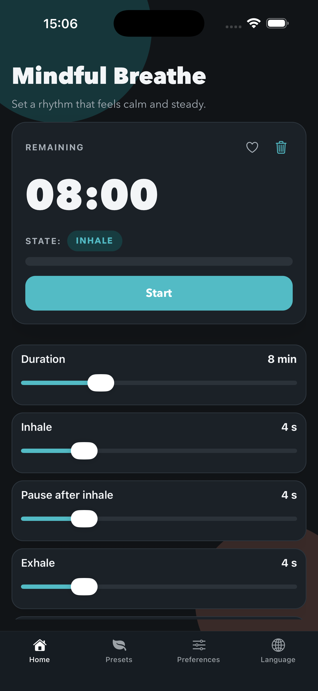
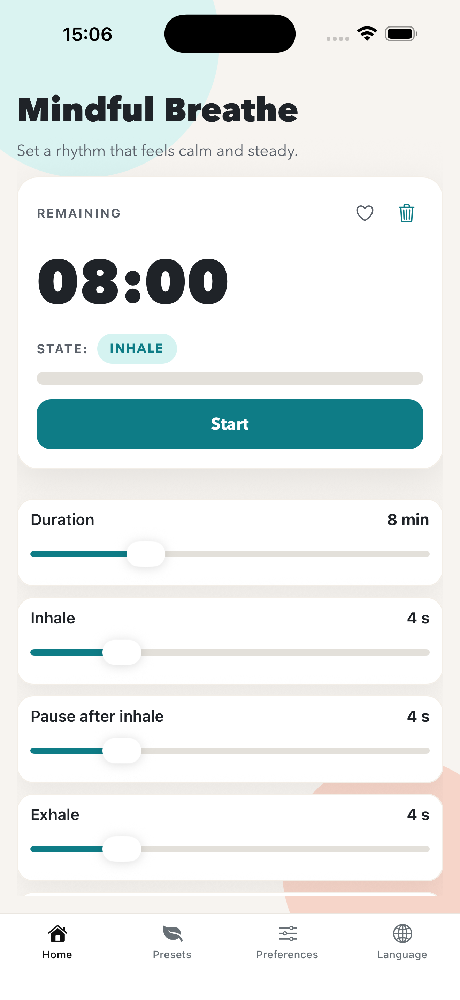
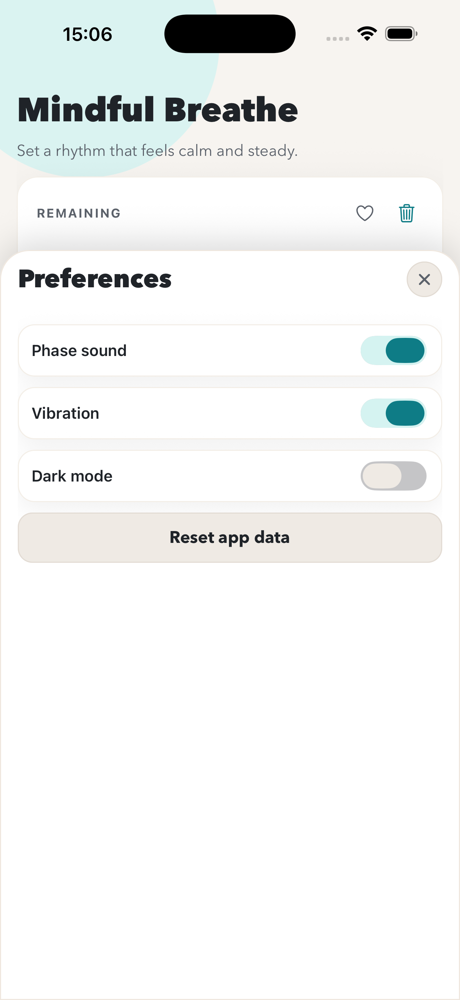
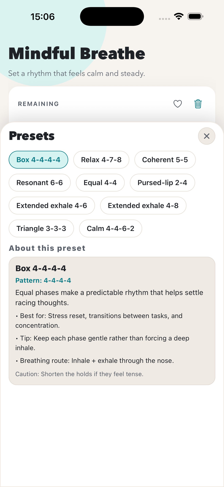

# Breathe

A calm, focused breathing coach that guides you through inhale, hold, and exhale cycles with clear visuals, gentle cues, and a modern, distraction-free UI. Use presets or craft your own rhythm to match relaxation, focus, or recovery sessions.

## Screenshots

| Dark home | Light home |
| --- | --- |
|  |  |

| Preferences | Presets |
| --- | --- |
|  |  |

## Features

- Guided breathing timer with phase-based progress and smooth transitions
- Built-in presets plus custom timing for each phase
- Preset education cards with practical context for each built-in breathing pattern
- Route guidance per preset (nose, nose-to-mouth, or pursed-lip exhale)
- Session length control with live remaining-time display
- Optional phase sounds and vibration cues
- Dark mode toggle in Preferences (saved across app restarts)
- Favorites, quick access to common patterns
- Multi-language UI (English, Spanish, French, German, Portuguese, Russian, Ukrainian, Hindi, Japanese, Polish)
- Responsive layout optimized for phones and tablets

### Guided Breathing Timer

- The timer cycles through inhale, hold, exhale, and pause phases in a clear sequence.
- Visual state labels and progress help users stay in sync without counting manually.
- Transitions are intentionally smooth to keep sessions calm and focused.

### Presets and Custom Timing

- Built-in presets provide ready-to-use breathing patterns for common goals.
- Users can adjust inhale, hold, exhale, and pause durations to create a custom rhythm.
- Custom combinations can be saved and reused in future sessions.

### Preset Education

- When a built-in preset is selected, the app shows an education panel directly in the Presets view.
- Each preset includes:
  - What the pattern is
  - Best use cases
  - A practical tip
  - A caution note
  - Recommended breathing route (nose, nose/mouth, or pursed-lip)
- Education copy is localized for all currently supported app languages.

### Breathing Route Guidance

- Route guidance explains how to inhale/exhale for each built-in pattern.
- Instructions support nose-only, nose-to-mouth, and pursed-lip breathing styles.
- Route details are shown alongside the preset education content.

### Session Length Control

- Total session duration can be adjusted to match quick breaks or longer routines.
- The app shows a live remaining-time readout during active sessions.
- Start/reset controls make it easy to restart after changing timings.

### Sound and Vibration Cues

- Optional phase sounds announce transitions between breathing phases.
- Optional vibration cues provide tactile feedback when visual attention is elsewhere.
- Both controls can be toggled independently in Preferences.

### Dark Mode

- Enable/disable dark mode from **Preferences**.
- The setting is persisted locally, so your choice is restored on next launch.
- Using **Reset app data** clears the saved preference and returns the app to light mode.
- Dark mode styles apply to the breathing screen, presets/language/preferences panels, and bottom navigation.

### Favorites and Quick Access

- Any preset can be marked as a favorite for faster reuse.
- Favorites are grouped in a dedicated area at the top of the Presets panel.
- This keeps frequently used patterns one tap away.

### Multi-language UI

- The app currently supports English, Spanish, French, German, Portuguese, Russian, Ukrainian, Hindi, Japanese, and Polish.
- Language can be changed from the dedicated Language panel.
- Labels and educational content update to the selected locale.

### Responsive Layout

- UI spacing and controls are optimized for both phones and tablets.
- Modal panels and controls remain usable across compact and large screens.
- Typography and card layouts are tuned for readability in different form factors.

## Technical

This is an Expo app using Expo Router.

### Run with Expo

1. Install dependencies

```bash
npm install
```

2. Start the app

```bash
npx expo start
```

You can open it in Expo Go, an Android emulator, or the iOS simulator from the Expo CLI.

### Run on local devices (USB)

Use the npm scripts to install on connected devices (these use the native projects under the hood).
If `ios/` and `android/` are not present (they are gitignored), generate them first:

```bash
npx expo prebuild
```

#### Android (physical device)

1. Enable Developer Options and USB debugging on the phone.
2. Plug the phone in via USB and accept the RSA prompt.
3. Build + install:

```bash
npm run android
```

#### iOS (physical device)

1. Install CocoaPods if needed and make sure Xcode is set up.
2. Plug the iPhone in via USB and trust the computer.
3. Build + install:

```bash
npm run ios
```

> Note: iOS device builds require a valid Apple Developer account and provisioning.

### Run on device without Metro (offline builds)

This builds a release binary with the JS bundle embedded, so the app runs without the Expo/Metro server.

#### Android (release APK)

```bash
cd android
./gradlew assembleRelease
```

APK output: `android/app/build/outputs/apk/release/`

#### Android (release AAB for Play Store)

```bash
cd android
./gradlew bundleRelease
```

AAB output: `android/app/build/outputs/bundle/release/`

#### Android Play Store notes (lessons learned)

- Play Console rejects bundles signed with the debug keystore.
- In `android/app/build.gradle`, `release` must use `signingConfigs.release` (not `signingConfigs.debug`).
- Keep release key settings in `android/gradle.properties`:
  - `MYAPP_UPLOAD_STORE_FILE`
  - `MYAPP_UPLOAD_KEY_ALIAS`
  - `MYAPP_UPLOAD_STORE_PASSWORD`
  - `MYAPP_UPLOAD_KEY_PASSWORD`
- Upload this file to Play Console: `android/app/build/outputs/bundle/release/app-release.aab`
- If `./gradlew clean bundleRelease` fails with CMake/codegen missing JNI directories, use:

```bash
cd android
./gradlew :app:bundleRelease
```

- If needed, clear native/generated caches and rerun:

```bash
rm -rf android/.cxx android/app/.cxx android/app/build/generated/autolinking android/app/build/intermediates
cd android
./gradlew :app:bundleRelease
```

- Optional stability fallback for release builds: set `newArchEnabled=false` in `android/gradle.properties`.

#### iOS (release via Xcode)

Open `ios/Breathe.xcworkspace` in Xcode, select “Any iOS Device”, then Product → Archive.

### iOS (Xcode)

If you need a native iOS build, the easiest path is:

```bash
npx expo run:ios
```

This generates the native project (if needed), installs Pods, and launches the app in the iOS simulator.
