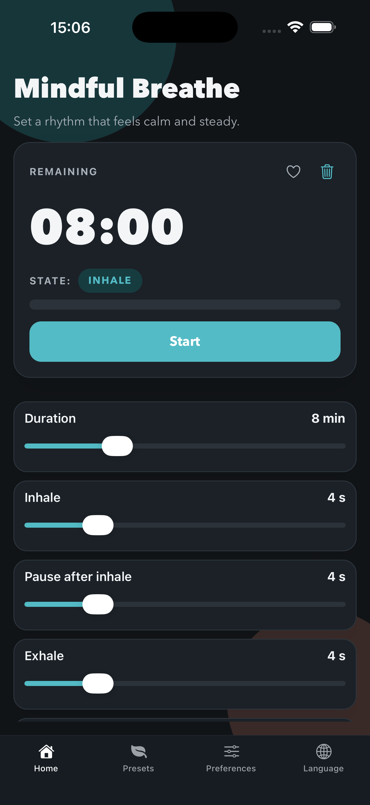
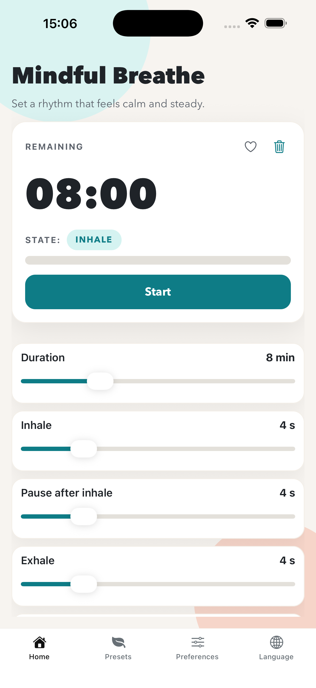
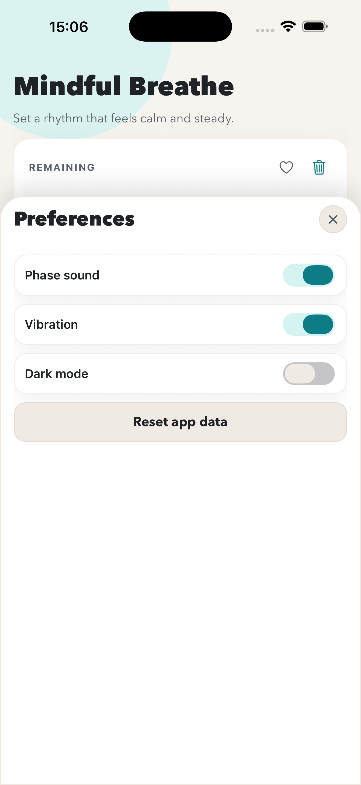
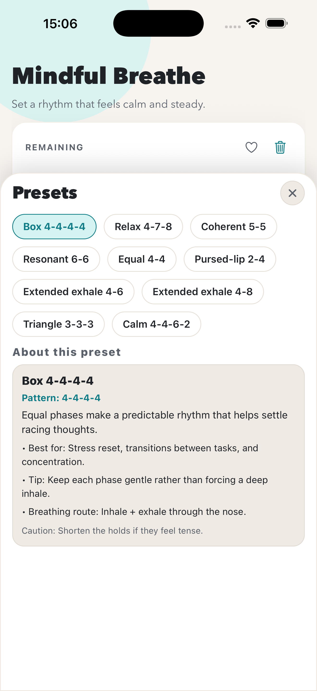

# Breathe Flutter

A calm, focused breathing coach that guides you through inhale, hold, and exhale cycles with clear visuals, gentle cues, and a modern, distraction-free UI. Use presets or craft your own rhythm to match relaxation, focus, or recovery sessions.

All commands below assume you are running them from the `flutter/` folder.

## Screenshots

The Flutter and React Native apps are intended to stay visually aligned, so the shared product screenshots are referenced here from the React Native assets.

| Dark home | Light home |
| --- | --- |
|  |  |

| Preferences | Presets |
| --- | --- |
|  |  |

## Features

- Guided breathing timer with phase-based progress and smooth transitions
- Built-in presets plus custom timing for each phase
- Preset education cards with practical context for each built-in breathing pattern
- Route guidance per preset (nose, nose-to-mouth, or pursed-lip exhale)
- Session length control with live remaining-time display
- Optional phase sounds and vibration cues
- Dark mode toggle in Preferences (saved across app restarts)
- Favorites, quick access to common patterns
- Multi-language UI (English, Spanish, French, German, Portuguese, Russian, Ukrainian, Hindi, Japanese, Polish)
- Responsive layout optimized for phones and tablets

### Guided Breathing Timer

- The timer cycles through inhale, hold, exhale, and pause phases in a clear sequence.
- Visual state labels and progress help users stay in sync without counting manually.
- Transitions are intentionally smooth to keep sessions calm and focused.

### Presets and Custom Timing

- Built-in presets provide ready-to-use breathing patterns for common goals.
- Users can adjust inhale, hold, exhale, and pause durations to create a custom rhythm.
- Custom combinations can be saved and reused in future sessions.

### Preset Education

- When a built-in preset is selected, the app shows an education panel directly in the Presets view.
- Each preset includes what the pattern is, best use cases, a practical tip, a caution note, and recommended breathing route guidance.
- Education copy is localized for all currently supported app languages.

### Breathing Route Guidance

- Route guidance explains how to inhale and exhale for each built-in pattern.
- Instructions support nose-only, nose-to-mouth, and pursed-lip breathing styles.
- Route details are shown alongside the preset education content.

### Session Length Control

- Total session duration can be adjusted to match quick breaks or longer routines.
- The app shows a live remaining-time readout during active sessions.
- Start and reset controls make it easy to restart after changing timings.

### Sound and Vibration Cues

- Optional phase sounds announce transitions between breathing phases.
- Optional vibration cues provide tactile feedback when visual attention is elsewhere.
- Both controls can be toggled independently in Preferences.

### Dark Mode

- Enable or disable dark mode from **Preferences**.
- The setting is persisted locally, so your choice is restored on next launch.
- Dark mode styles apply to the breathing screen, presets, language, preferences, and bottom navigation.

### Favorites and Quick Access

- Any preset can be marked as a favorite for faster reuse.
- Favorites are grouped in a dedicated area for quick access.
- This keeps frequently used patterns one tap away.

### Multi-language UI

- The app currently supports English, Spanish, French, German, Portuguese, Russian, Ukrainian, Hindi, Japanese, and Polish.
- Language can be changed from the dedicated Language panel.
- Labels and preset education content update to the selected locale.

### Responsive Layout

- UI spacing and controls are optimized for both phones and tablets.
- Layout and typography are tuned for readability across compact and large screens.

## Wearable Companions

The Flutter project ships two standalone wearable apps alongside the phone app.

### Apple Watch (`ios/BreatheWatch/`)

A native Swift/SwiftUI watch app that runs independently — no phone required.

- Built and run via Xcode: open `ios/Runner.xcworkspace`, select the **BreatheWatch** scheme, choose a Watch simulator
- All 10 presets, full breathing timer, haptic feedback on each phase transition
- Source files: `ios/BreatheWatch/` (Swift only, no Flutter)

### Wear OS (`android/wearos/`)

A standalone Flutter app targeting Wear OS (API 26+).

```bash
cd android/wearos
flutter pub get
flutter run
```

- All 10 presets, full breathing timer, haptic feedback on each phase transition
- Requires a Wear OS emulator (Android Studio → Device Manager → Wear OS Small Round) or a physical Wear OS watch

## Technical

This is a Flutter app built with Material 3 and platform-specific Flutter runners for iOS, Android, macOS, Linux, Windows, and web.

### Run with Flutter

1. Install Flutter.
2. Fetch dependencies:

```bash
flutter pub get
```

3. Run checks:

```bash
flutter analyze
flutter test
```

4. Launch the app:

```bash
flutter run
```

To launch a release build instead of the default debug build:

```bash
flutter run --release
```

### Run on iOS Simulator

1. Make sure Xcode and an iOS Simulator are installed.
2. Start a simulator, then confirm the available device list:

```bash
flutter devices
```

3. Run on the simulator:

```bash
flutter run -d <device-id>
```

### Run on Android

1. Make sure Android Studio or the Android SDK is installed.
2. Start an emulator or connect a device, then check available devices:

```bash
flutter devices
```

3. Run on Android:

```bash
flutter run -d <device-id>
```

To run the Android app in release mode instead of debug:

```bash
flutter run --release -d <device-id>
```

### Build Release Binaries

#### Android APK

```bash
flutter build apk
```

APK output: `build/app/outputs/flutter-apk/`

#### Android App Bundle

```bash
flutter build appbundle
```

AAB output: `build/app/outputs/bundle/release/`

#### iOS

```bash
flutter build ios --release
```

For App Store distribution, you can also open `ios/Runner.xcworkspace` in Xcode and archive from there.
The default `Runner` scheme keeps Xcode's **Run** action on `Debug`.
If you want a production-style build when launching from Xcode to a physical iPhone, switch to the shared `Runner Release` scheme before pressing **Run**.
If a previously installed debug build still shows the "can only be launched from Flutter tooling" message after you switch schemes, delete the app from the device and reinstall it from `Runner Release`.
